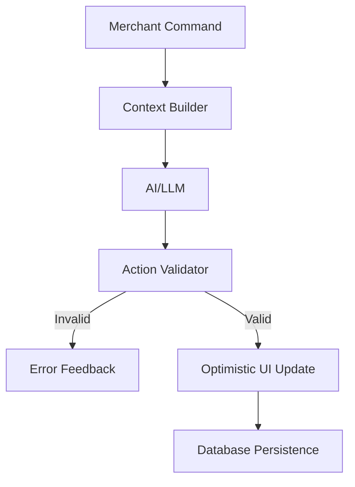

# AI Action Layer Specification (The "Brain" of the Store)

This document outlines the architecture for the **AI Action Layer**, the system responsible for translating natural language merchant commands into safe, valid UI updates.

## 1. Core Architecture

The system follows a 5-step pipeline:
`Command` -> `Context Builder` -> `LLM Processing` -> `Action Validation` -> `Execution`



## 2. Schema-First Design (The Interface)

Every editable component MUST export an `AI_SCHEMA`. This acts as the API contract for the AI.

```ts
// Example: app/components/store-sections/HeroSection.schema.ts
export const HERO_SECTION_AI_SCHEMA = {
  component: "hero",
  version: "1.0",
  properties: {
    title: {
      type: "text",
      aiEditable: true,
      maxLength: 100,
      aiPrompt: "Compelling hero title for {storeType} store",
      examples: ["Welcome to Our Store", "New Collection 2025"],
    },
    background: {
      type: "object",
      aiEditable: true,
      properties: {
        color: {
          type: "color",
          aiTransform: "hexToRgb",
          constraints: { minBrightness: 0.3 },
        },
        image: {
          type: "image",
          aiAction: "generate",
          constraints: { maxSizeMB: 2, aspectRatio: "16:9" },
        },
      },
    },
    ctaButton: {
      type: "object",
      aiEditable: true,
      properties: {
        text: {
          type: "text",
          aiEnum: ["Shop Now", "Explore", "Get Started"],
        },
      },
    },
  },
};
```

## 3. Context Building (The "Eyes")

The AI cannot make decisions in a vacuum. It needs the **Store Context**.

```ts
// app/services/ai-context-builder.ts
export async function buildAIContext(storeId: string): Promise<AIContext> {
  const store = await getStore(storeId);
  const config = await getStoreConfig(storeId);

  return {
    store: {
      name: store.name,
      type: detectStoreType(store.products), // e.g., "fashion", "tech"
      topCategories: getTopCategories(store.products),
    },
    config: {
      flashSaleActive: config.flashSale.active,
      shippingThreshold: config.shipping.freeThreshold,
    },
    currentTheme: store.activeTheme, // e.g., "AuroraMinimal"
  };
}
```

## 4. Action Validation (The Safety Net)

AI output is untrusted. We validate every action against the schema and business rules.

**Validation Rules:**

1.  **Type Safety**: Does the hex code match regex? Is the text within length limits?
2.  **Logic Constraints**: Does the section exist? Is the User allowed to delete it?
3.  **Security**: Check for XSS or malicious script tags.
4.  **Confidence**: If `confidence < 0.85`, require manual confirmation.

## 5. Security & Limits

- **Rate Limiting**:
  - Free: 20 cmds/15min
  - Pro: 100 cmds/15min
- **Cost Budgeting**: Monthly hard caps per store to prevent API bill shock.

## 6. Prompt Engineering Strategy

We use a structured prompt injection:

> **System**: "You are STORE_AI. Conversions cmds to JSON."
> **Context**: [JSON Dump of Store State] > **Schema**: [JSON Schema of Target Component] > **User**: "Make the hero background red."

## 7. Developer Experience

- **Schema Generator**: CLI tool to auto-generate basic schemas from TypeScript interfaces.
- **Visual Validator**: DevTool to highlight which props are AI-editable.
