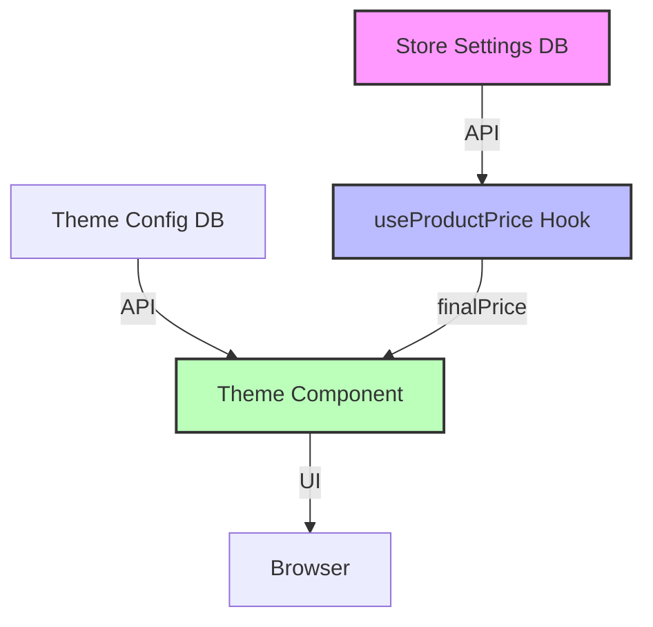

# The Ultimate Store Theme Building Guide: "Pure UI" Architecture

**Version 3.0 | Production-Ready Standard (Feature Folder Architecture)**

> **Core Philosophy:** _Every store shares the same brain (logic), but wears a different skin (design). Like Shopify, but with AI-native DNA._

---

## **Phase 1: Core Architecture Principles**

### **1.1 "Logic Centralization" Pattern**

**Difference from Shopify:** In Shopify, each theme has logic in `.liquid` files. In your system, **themes contain NO logic, only UI**.

```typescript
// ❌ WRONG (Shopify-Style): Logic inside the theme
// themes/modern/components/ProductCard.tsx
function ProductCard({ product }) {
  const price = product.price * (1 - discount); // Logic in the wrong place
  return <div>{price}</div>;
}

// ✅ CORRECT (Pure UI): Logic only in hooks
// themes/modern/components/ProductCard.tsx
function ProductCard({ product }) {
  const { finalPrice, discountLabel } = useProductPrice(product); // Fetch from hook
  return (
    <div>
      {finalPrice} {discountLabel}
    </div>
  );
}
```

**How it works:**

- Every theme calls the same `useProductPrice` hook.
- The hook fetches `StoreSettings` from the backend.
- The theme only handles rendering.

---

### **1.2 Data Flow Architecture**



**Important:** `Store Settings` are completely decoupled from the theme.

---

## **Phase 2: Hydration & SSR Safety (Crucial)**

Templates rely on client-side storage for Cart and Wishlist. To prevent **Hydration Mismatches**, you **MUST** use the `ClientOnly` wrapper.

```tsx
import { ClientOnly } from "remix-utils/client-only";
import { SkeletonLoader } from "~/components/SkeletonLoader";

export function TemplateWrapper({ config, children }: any) {
  return (
    <ClientOnly fallback={<SkeletonLoader />}>{() => children}</ClientOnly>
  );
}
```

---

## **Phase 3: Theme File Structure (Feature Folder Architecture)**

### **3.1 Directory Structure (Current Standard)**

All store templates live in `/app/components/store-templates/`. Each template is a self-contained **Feature Folder**.

```
/app/components/store-templates/
  /[template-id]/                   # e.g., /luxe-boutique/, /tech-modern/
    index.tsx                       # Main template component (StoreTemplateProps)
    theme.ts                        # Design tokens & color palette
    /sections/
      Header.tsx                    # Self-contained Header component
      Footer.tsx                    # Self-contained Footer component
    /blocks/                        # (Optional) Reusable UI blocks
      ProductCard.tsx
      Button.tsx
    /styles/                        # (Optional) Animation, font tokens
      tokens.ts
      animations.ts
```

### **3.2 Key Files Explained**

| File                  | Purpose                                                                                                              |
| --------------------- | -------------------------------------------------------------------------------------------------------------------- |
| `index.tsx`           | Exports the main `[TemplateName]Template` component. This is registered in `store-registry.ts`.                      |
| `theme.ts`            | Exports a constant like `LUXE_BOUTIQUE_THEME` containing all colors, fonts, and shadows.                             |
| `sections/Header.tsx` | A fully self-contained header. Uses internal state for `mobileMenuOpen`, `searchQuery`, etc. if props aren't passed. |
| `sections/Footer.tsx` | A fully self-contained footer. Renders branding, categories, and business info.                                      |

---

### **3.3 Template Index File Example**

`app/components/store-templates/luxe-boutique/index.tsx`:

```typescript
import { LuxeBoutiqueHeader } from "./sections/Header";
import { LuxeBoutiqueFooter } from "./sections/Footer";
import { LUXE_BOUTIQUE_THEME } from "./theme";
import type { StoreTemplateProps } from "~/templates/store-registry";

export function LuxeBoutiqueTemplate({
  storeName,
  products,
  categories,
  config,
  footerConfig,
  socialLinks,
  businessInfo,
  planType,
  isPreview,
}: StoreTemplateProps) {
  const theme = LUXE_BOUTIQUE_THEME;

  return (
    <div style={{ backgroundColor: theme.background }}>
      <LuxeBoutiqueHeader storeName={storeName} categories={categories} />
      {/* ... Product Grid, Hero, etc. ... */}
      <LuxeBoutiqueFooter
        storeName={storeName}
        footerConfig={footerConfig}
        categories={categories}
        planType={planType}
      />
    </div>
  );
}
```

---

### **3.4 Self-Contained Header Example**

Headers must be **self-contained**: they handle their own state if props aren't provided. This allows them to work seamlessly in both `StorePageWrapper` and the `LiveEditor`.

`app/components/store-templates/luxe-boutique/sections/Header.tsx`:

```typescript
import React, { useState } from "react";
import { useCartCount } from "~/hooks/useCartCount";
import { LUXE_BOUTIQUE_THEME } from "../theme";

interface LuxeBoutiqueHeaderProps {
  storeName: string;
  categories: (string | null)[];
  count?: number; // Optional: passed by parent OR from hook
  mobileMenuOpen?: boolean; // Optional: controlled OR local state
  setMobileMenuOpen?: (open: boolean) => void;
}

export function LuxeBoutiqueHeader({
  storeName,
  categories = [],
  count: countProp,
  mobileMenuOpen: mobileMenuOpenProp,
  setMobileMenuOpen: setMobileMenuOpenProp,
}: LuxeBoutiqueHeaderProps) {
  const theme = LUXE_BOUTIQUE_THEME;

  // === Self-Contained State ===
  const [localMobileMenuOpen, setLocalMobileMenuOpen] = useState(false);
  const cartCount = useCartCount(); // Hook for cart count

  const mobileMenuOpen = mobileMenuOpenProp ?? localMobileMenuOpen;
  const setMobileMenuOpen = setMobileMenuOpenProp ?? setLocalMobileMenuOpen;
  const count = countProp ?? cartCount;

  // Filter null categories for safe iteration
  const validCategories = categories.filter((c): c is string => Boolean(c));

  return (
    <header style={{ backgroundColor: theme.headerBg }}>
      {/* ... Header JSX ... */}
    </header>
  );
}
```

---

### **3.5 Theme Tokens File Example**

`app/components/store-templates/luxe-boutique/theme.ts`:

```typescript
export const LUXE_BOUTIQUE_THEME = {
  // Core Palette
  primary: "#1a1a1a",
  accent: "#c9a961",
  background: "#faf9f7",
  text: "#1a1a1a",
  textMuted: "#6b6b6b",

  // Component Styles
  headerBg: "#ffffff",
  footerBg: "#1a1a1a",
  footerText: "#faf9f7",
  cardBg: "#ffffff",
  border: "#e0e0e0",

  // Typography
  fontHeading: "'Playfair Display', serif",
  fontBody: "'Inter', sans-serif",

  // Shadows
  cardShadow: "0 4px 6px rgba(0,0,0,0.05)",
};
```

---

## **Phase 4: Registering Templates**

All store templates are registered in `app/templates/store-registry.ts`. This is the **Single Source of Truth** for available templates.

### **4.1 Adding a New Template to the Registry**

```typescript
// In app/templates/store-registry.ts

// 1. Import theme tokens for the registry's theme map
import { MY_NEW_THEME } from "~/components/store-templates/my-new-template/theme";

// 2. Lazy load the component
const MyNewTemplate = React.lazy(() =>
  import("~/components/store-templates/my-new-template/index").then((m) => ({
    default: m.MyNewTemplate,
  }))
);
const MyNewHeader = React.lazy(() =>
  import("~/components/store-templates/my-new-template/sections/Header").then(
    (m) => ({ default: m.MyNewHeader })
  )
);
const MyNewFooter = React.lazy(() =>
  import("~/components/store-templates/my-new-template/sections/Footer").then(
    (m) => ({ default: m.MyNewFooter })
  )
);

// 3. Add to STORE_TEMPLATE_THEMES
export const STORE_TEMPLATE_THEMES = {
  // ... other themes
  "my-new-template": {
    primary: MY_NEW_THEME.primary,
    accent: MY_NEW_THEME.accent,
    // ...
  },
};

// 4. Add to STORE_TEMPLATES array
export const STORE_TEMPLATES: StoreTemplateDefinition[] = [
  // ... other templates
  {
    id: "my-new-template",
    name: "My New Template",
    description: "Description of the template.",
    thumbnail: "/templates/my-new-template.png",
    category: "modern",
    theme: STORE_TEMPLATE_THEMES["my-new-template"],
    fonts: { heading: "Inter", body: "Inter" },
    component: MyNewTemplate,
    Header: MyNewHeader,
    Footer: MyNewFooter,
  },
];
```

---

## **Phase 5: Design Token Best Practices**

- **No hardcoded hex codes in JSX.** All colors must come from the `theme.ts` file.
- **Use relative imports** (`../theme`) within the template folder.
- **Consistent naming:** `primary`, `accent`, `headerBg`, `footerBg`, etc.

---

## **Phase 6: Performance & Bundle Optimization**

### **6.1 Image Optimization**

Use the project's `<OptimizedImage />` component for all images.

```tsx
import { OptimizedImage } from "~/components/OptimizedImage";

function ProductImage({ src, alt }) {
  return <OptimizedImage src={src} alt={alt} />;
}
```

### **6.2 Lazy Loading Templates**

Templates are loaded via `React.lazy` in `store-registry.ts`. This keeps the initial bundle size small.

---

## **Phase 7: Final Checklist for World-Class Themes**

- [ ] **Zero business logic** in components (Use hooks: `useProductPrice`, `useWishlist`, `useCartCount`)
- [ ] **Self-contained Headers/Footers** with local state fallbacks
- [ ] **Theme tokens** defined in `theme.ts` and used consistently
- [ ] **Registered in `store-registry.ts`** with Header and Footer components
- [ ] **Wrapped in `ClientOnly`** for hydration safety where needed
- [ ] **Responsive** (Mobile-first design)
- [ ] **Type-safe** (TypeScript strict mode, `StoreTemplateProps`)
