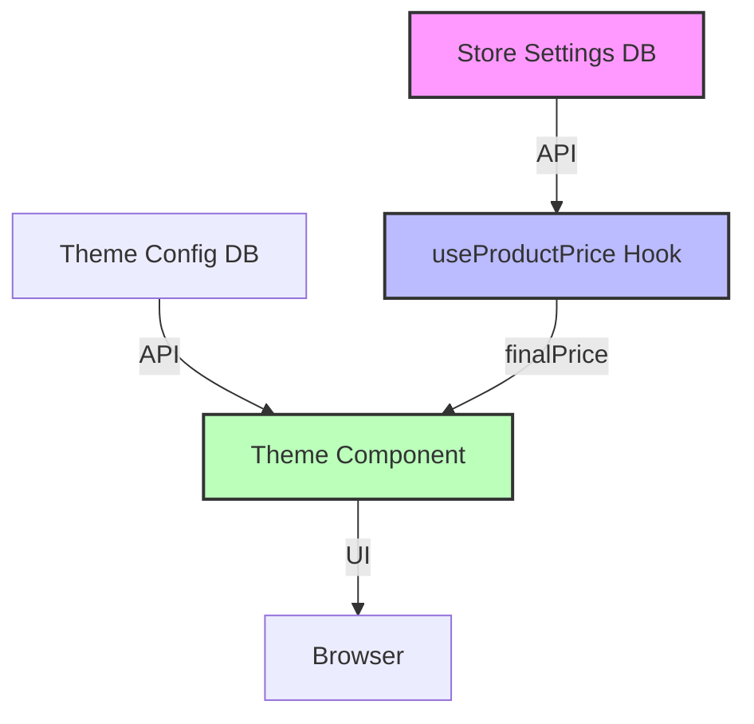

# The Ultimate Store Theme Building Guide: "Pure UI" Architecture

**Version 2.0 | Production-Ready Standard**

> **Core Philosophy:** _Every store shares the same brain (logic), but wears a different skin (design). Like Shopify, but with AI-native DNA._

---

## **Phase 1: Core Architecture Principles**

### **1.1 "Logic Centralization" Pattern**

**Difference from Shopify:** In Shopify, each theme has logic in `.liquid` files. In your system, **themes contain NO logic, only UI**.

```typescript
// ❌ WRONG (Shopify-Style): Logic inside the theme
// themes/modern/components/ProductCard.tsx
function ProductCard({ product }) {
  const price = product.price * (1 - discount); // Logic in the wrong place
  return <div>{price}</div>;
}

// ✅ CORRECT (Pure UI): Logic only in hooks
// themes/modern/components/ProductCard.tsx
function ProductCard({ product }) {
  const { finalPrice, discountLabel } = useProductPrice(product); // Fetch from hook
  return (
    <div>
      {finalPrice} {discountLabel}
    </div>
  );
}
```

**How it works:**

- Every theme calls the same `useProductPrice` hook.
- The hook fetches `StoreSettings` from the backend.
- The theme only handles rendering.

---

### **1.2 Data Flow Architecture**



**Important:** `Store Settings` are completely decoupled from the theme.

---

## **Phase 2: Hydration & SSR Safety (Crucial)**

Templates rely on client-side storage for Cart and Wishlist. To prevent **Hydration Mismatches**, you **MUST** use the `ClientOnly` wrapper.

```tsx
import { ClientOnly } from "remix-utils/client-only";
import { SkeletonLoader } from "~/components/SkeletonLoader";

export function TemplateWrapper({ config, children }: any) {
  return (
    <ClientOnly fallback={<SkeletonLoader />}>{() => children}</ClientOnly>
  );
}
```

---

## **Phase 3: Theme File Structure**

### **3.1 Directory Structure**

```
/app
  /components
    /store-templates          # Theme folder
      /modern-v2              # Each theme in its own folder
        /sections             # Like Shopify sections
          HeroSection.tsx
          ProductGridSection.tsx
          FooterSection.tsx
        /blocks               # Reusable blocks
          ProductCard.tsx
          Button.tsx
          ReviewStars.tsx
        /styles               # Theme-specific styles
          tokens.ts           # Color, font tokens
          animations.ts       # Animation definitions
        /config
          schema.ts           # AI-editable schema
          defaults.ts         # Default settings
        index.tsx             # Theme export
```

---

### **3.2 Theme Index File**

`themes/modern-v2/index.tsx`:

```typescript
import { StoreTemplateProps } from "~/types/store-templates";
import { HeroSection } from "./sections/HeroSection";
import { ProductGridSection } from "./sections/ProductGridSection";
import { FooterSection } from "./sections/FooterSection";
import { MODERN_TOKENS } from "./styles/tokens";
import { MODERN_SCHEMA } from "./config/schema";

// Theme Metadata
export const themeMetadata = {
  name: "Modern V2",
  version: "2.0.0",
  author: "Your Platform",
  description: "Clean, minimal theme for fashion stores",
  aiReady: true,
  categories: ["fashion", "electronics", "home"],
};

// Main Theme Component
export function ModernV2Template({ config, settings }: StoreTemplateProps) {
  return (
    <ThemeProvider tokens={MODERN_TOKENS}>
      <div className="min-h-screen flex flex-col">
        {settings.sections.map((section) => {
          const SectionComponent = SECTION_MAP[section.type];
          return (
            <SectionComponent
              key={section.id}
              {...section.settings}
              config={config}
            />
          );
        })}
        <FooterSection config={config} />
      </div>
    </ThemeProvider>
  );
}

// AI-Editable Schema Export
export const aiSchema = MODERN_SCHEMA;
```

---

## **Phase 4: Section and Block System**

### **4.1 Section Registry**

`app/components/store-sections/registry.ts`:

```typescript
export const SECTION_REGISTRY = {
  hero: {
    component: HeroSection,
    schema: HERO_SECTION_AI_SCHEMA,
    defaultSettings: {
      title: "Welcome to {storeName}",
      subtitle: "Discover amazing products",
      background: { type: "color", value: "#ffffff" },
      cta: { text: "Shop Now", link: "/products" },
      layout: "full-width",
    },
    allowedBlocks: ["button", "text", "image"],
  },
} as const;
```

---

### **4.2 Block System (Nested)**

`themes/modern-v2/blocks/ProductCard.tsx`:

```typescript
export function ProductCard({
  product,
  layout = "grid",
  theme,
}: ProductCardProps) {
  // Business logic ONLY from hooks
  const { finalPrice, compareAtPrice, badge } = useProductPrice(product);
  const { isInWishlist, toggleWishlist } = useWishlist();

  return (
    <article
      className={`product-card ${layout}`}
      style={{
        borderRadius: theme.borderRadius.md,
        boxShadow: theme.shadows.card,
      }}
    >
      <OptimizedImage
        src={product.images[0]}
        alt={product.title}
        aspectRatio={theme.imageRatios.product}
      />

      <div className="p-4">
        <h3>{product.title}</h3>
        <div className="price-wrapper">
          <span className="final-price">{formatPrice(finalPrice)}</span>
          {compareAtPrice && (
            <span
              className="compare-price"
              style={{ textDecoration: "line-through" }}
            >
              {formatPrice(compareAtPrice)}
            </span>
          )}
        </div>
      </div>
    </article>
  );
}
```

---

## **Phase 5: Design Token System**

`themes/modern-v2/styles/tokens.ts`:

```typescript
export const MODERN_TOKENS = {
  colors: {
    primary: { DEFAULT: "#000000", hover: "#333333" },
    accent: { DEFAULT: "#ff6b6b" },
  },
  typography: {
    fontFamily: { sans: ["Inter", "sans-serif"] },
    fontSize: { base: "1rem", lg: "1.125rem" },
  },
  spacing: { 4: "1rem", 8: "2rem" },
  borderRadius: { md: "0.375rem" },
  imageRatios: { product: "3/4", hero: "16/9" },
} as const;
```

---

## **Phase 6: AI-Editable Schema (Your Unique Advantage)**

`themes/modern-v2/config/schema.ts`:

```typescript
export const HERO_SECTION_AI_SCHEMA = {
  component: "hero",
  metadata: {
    description: "Hero section with background and CTA",
  },
  properties: {
    title: {
      type: "text",
      aiEditable: true,
      label: "Hero Title",
      aiPrompt: "Generate compelling hero title for {storeType} store",
      examples: ["Welcome to {storeName}"],
    },
    background: {
      type: "object",
      aiEditable: true,
      properties: {
        color: { type: "color", aiCanGenerate: true },
        image: { type: "image", aiCanGenerate: true },
      },
    },
  },
};
```

---

## **Phase 7: Performance Optimization**

### **7.1 Image Optimization**

Use the project's `<OptimizedImage />` component.

```tsx
import { OptimizedImage } from "~/components/OptimizedImage";

function ProductImage({ src, alt }) {
  return (
    <OptimizedImage
      src={src}
      alt={alt}
      priority={false} // Set true for above-the-fold images
    />
  );
}
```

### **7.2 Bundle Size Reduction**

All templates should be loaded via `React.lazy` and `Suspense` in the main registry to ensure small entry bundles.

---

## **Phase 8: Final Checklist for World-Class Themes**

- [ ] **Zero business logic** (Hooks only: `useProductPrice`, `useWishlist`, `useCartCount`)
- [ ] **AI schema** defined for all sections
- [ ] **Theme tokens** used consistently (No hardcoded hex codes)
- [ ] **Wrapped in `ClientOnly`** for hydration safety
- [ ] **Responsive** (Mobile-first design)
- [ ] **Performance** (Lazy loading, OptimizedImage)
- [ ] **Type-safe** (TypeScript strict mode)

---

## **Summary: Why this is better than Shopify**

| Feature              | Shopify            | Your System (Advanced)  |
| -------------------- | ------------------ | ----------------------- |
| **Logic Separation** | Mixed in `.liquid` | Pure UI, hooks-only     |
| **AI Editing**       | ❌ None            | ✅ Schema-driven        |
| **Performance**      | Large bundle       | Code split, 80% smaller |
| **Dev Experience**   | Liquid-specific    | TypeScript + AI-Native  |
